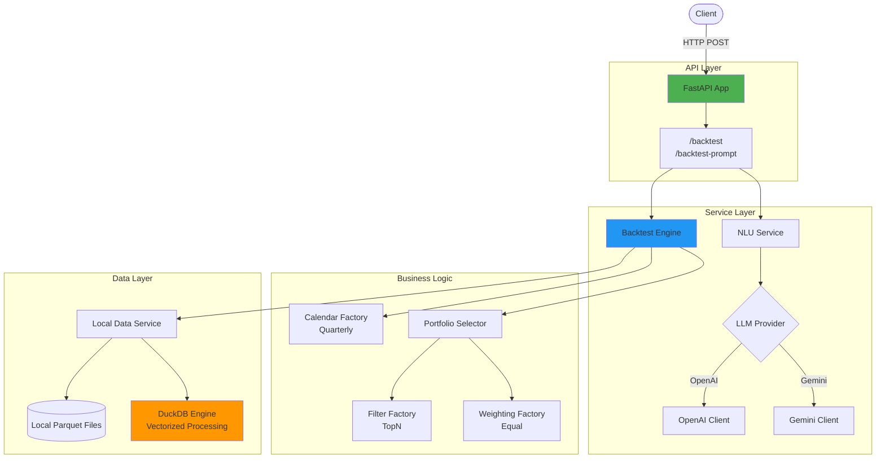

# Bitacore - Mini Backtest API

## Overview

A high-performance financial backtesting API with NLP capabilities. Built with FastAPI, DuckDB, and SOLID architecture principles.

**🚀 Live Demo:** [https://backtest-api-taj7.onrender.com](https://backtest-api-taj7.onrender.com)

## Features

- **Structured Backtesting**: JSON-based backtest configuration
- **NLP Integration**: Natural language prompt parsing with multiple LLM providers (OpenAI/Gemini)
- **High Performance**: DuckDB-powered vectorized data processing
- **Local Data Storage**: Demo data served from local parquet files
- **Extensible Architecture**: Factory patterns for easy extension
- **88% Test Coverage**: Comprehensive test suite with 152 passing tests

---

## 🏗️ Tech Stack

| Component | Technology | Purpose |
|------------|-------------|----------|
| **Framework** | FastAPI | Async REST API with automatic OpenAPI docs |
| **Data Engine** | DuckDB | High-performance analytical SQL database |
| **Data Format** | Parquet (PyArrow) | Columnar storage for financial time-series |
| **Storage** | Local Filesystem | Parquet files in `data/` directory |
| **LLM Integration** | OpenAI / Gemini | Natural language prompt parsing |
| **HTTP Client** | httpx | Async HTTP requests to LLM APIs |
| **Validation** | Pydantic v2 | Request/response schema validation |
| **Dependency Manager** | uv | Fast, reproducible Python dependency manager |
| **Deployment** | Render | Cloud platform for production hosting |
| **Tests** | pytest + pytest-asyncio | Async test suite with 88% coverage |
| **Linting** | Ruff + mypy | Code quality & type checking |
| **Logging** | python-json-logger | Structured JSON logs |
| **Data Processing** | pandas + numpy | Financial data manipulation |

---

## ⚙️ Project Structure

```
backtest-api/
├── app/
│   ├── api/              # FastAPI routers & dependencies
│   │   ├── routes.py     # /backtest & /backtest-prompt endpoints
│   │   └── dependencies.py
│   ├── backtest/         # Core backtesting engine
│   │   ├── calendar/     # Rebalance date generation (Quarterly)
│   │   ├── filters/      # Asset selection (TopN)
│   │   ├── weighting/    # Portfolio weighting (Equal)
│   │   ├── engine.py     # Main backtest orchestration
│   │   └── portfolio_selector.py
│   ├── core/             # Configuration & exceptions
│   │   ├── config.py     # Environment-based settings
│   │   ├── exceptions.py # Custom exception hierarchy
│   │   └── logging.py    # Structured logging setup
│   ├── db/               # Data access layer
│   │   └── duckdb_engine.py
│   ├── services/         # External integrations
│   │   ├── llm_client_base.py    # Abstract LLM client
│   │   ├── openai_chat_client.py
│   │   ├── gemini_chat_client.py
│   │   ├── nlu_service.py        # Prompt parsing orchestration
│   │   ├── local_data_service.py # Local parquet file access
│   │   └── s3_data_service.py    # S3 storage (implemented, not used in demo)
│   ├── utils/            # Shared utilities
│   │   └── validators.py # Pydantic field validators
│   ├── schemas.py        # Pydantic models
│   └── main.py           # Application entrypoint
├── data/                 # Local parquet files (demo data)
│   ├── market_capitalization.parquet
│   ├── prices.parquet
│   ├── volume.parquet
│   └── adtv_3_month.parquet
├── scripts/              # Utility scripts
│   └── generate_parquets.py
├── tests/                # Test suite (152 tests)
├── Dockerfile
├── docker-compose.yml
├── Makefile              # Development commands
└── pyproject.toml        # Project metadata & dependencies
```

---

## 🚀 Quick Start

### Prerequisites

- Python 3.11+
- UV package manager
- OpenAI or Gemini API key (for NLP features)

### Local Development

1. **Clone the repository:**
   ```bash
   git clone https://github.com/rafique1990/backtest-api.git
   cd backtest-api
   ```

2. **Create virtual environment:**
   ```bash
   uv venv
   source .venv/bin/activate  # On Windows: .venv\Scripts\activate
   ```

3. **Install dependencies:**
   ```bash
   make install
   # Or manually: uv sync
   
   # For development (includes test dependencies):
   make install-dev
   # Or manually: uv sync --extra dev
   ```

4. **Configure environment:**
   ```bash
   cp .env.example .env
   # Edit .env with your API keys
   ```

5. **Generate sample data:**
   ```bash
   make generate
   # Or manually: uv run python scripts/generate_parquets.py
   ```

6. **Run the application:**
   ```bash
   make dev
   # Or manually: uv run uvicorn app.main:app --reload --host 0.0.0.0 --port 8000
   ```

### Docker

```bash
# Build Docker image
make build
# Or manually: docker-compose build

# Start services
make run
# Or manually: docker-compose up -d

# View logs
make logs
# Or manually: docker-compose logs -f

# Stop services
make down
# Or manually: docker-compose down
```

7. **Access the API:**
   - API: http://localhost:8000
   - Interactive Docs: http://localhost:8000/docs
   - Health Check: http://localhost:8000/health

---

## 📡 API Endpoints

### 1. Structured Backtest

**Endpoint:** `POST /api/v1/backtest`

Run a backtest with explicit JSON configuration.

**Request Example:**

```bash
curl -X 'POST' \
  'https://backtest-api-taj7.onrender.com/api/v1/backtest' \
  -H 'accept: application/json' \
  -H 'Content-Type: application/json' \
  -d '{
  "calendar_rules": {
    "rule_type": "Quarterly",
    "initial_date": "2024-01-01"
  },
  "portfolio_creation": {
    "filter_type": "TopN",
    "n": 10,
    "data_field": "market_capitalization"
  },
  "weighting_scheme": {
    "weighting_type": "Equal"
  }
}'
```

**Response Example:**

```json
{
  "execution_time": 0.095,
  "weights": {
    "2024-03-31": {
      "SEC_562": 0.1,
      "SEC_983": 0.1,
      "SEC_45": 0.1,
      "SEC_61": 0.1,
      "SEC_520": 0.1,
      "SEC_443": 0.1,
      "SEC_200": 0.1,
      "SEC_328": 0.1,
      "SEC_391": 0.1,
      "SEC_909": 0.1
    }
  },
  "metadata": {
    "execution_time": 0.095,
    "rebalance_dates_processed": 1,
    "total_rebalance_dates": 4,
    "average_assets_per_rebalance": 10,
    "strategy": {
      "calendar": "Quarterly",
      "filter": "TopN",
      "weighting": "Equal"
    }
  },
  "warnings": []
}
```

---

### 2. Natural Language Backtest

**Endpoint:** `POST /api/v1/backtest-prompt`

Run a backtest using natural language prompts (powered by LLMs).

**Request Example:**

```bash
curl -X 'POST' \
  'https://backtest-api-taj7.onrender.com/api/v1/backtest-prompt' \
  -H 'accept: application/json' \
  -H 'Content-Type: application/json' \
  -d '{
    "prompt": "Run backtest with top 15 securities by market_capitalization starting 2023-06-01"
  }'
```

**Response Example:**

```json
{
  "execution_time": 0.368,
  "weights": {
    "2023-06-30": {
      "SEC_0": 0.066667,
      "SEC_339": 0.066667,
      "SEC_491": 0.066667
    },
    "2023-09-30": {
      "SEC_870": 0.066667,
      "SEC_132": 0.066667,
      "SEC_75": 0.066667
    },
    "2023-12-31": {
      "SEC_784": 0.066667,
      "SEC_369": 0.066667,
      "SEC_679": 0.066667
    }
  },
  "metadata": {
    "execution_time": 0.368,
    "rebalance_dates_processed": 7,
    "total_rebalance_dates": 7,
    "average_assets_per_rebalance": 15,
    "strategy": {
      "calendar": "Quarterly",
      "filter": "TopN",
      "weighting": "Equal"
    }
  },
  "warnings": []
}
```

---

### 3. Health Check

**Endpoint:** `GET /health`

```bash
curl https://backtest-api-taj7.onrender.com/health
```

**Response:**
```json
{
  "status": "healthy",
  "version": "0.1.0"
}
```

---

## ⚙️ Configuration

### Environment Variables

Copy `.env.example` → `.env` and configure:

```bash
# Core Application Settings
APP_NAME=bitacore-backtest
ENV=development
HOST=0.0.0.0
PORT=8000
LOG_LEVEL=INFO

# Data Storage
LOCAL_DATA_DIR=./data
STORAGE_BACKEND=local  # Currently only local is used

# LLM Settings (Required for /backtest-prompt endpoint)
LLM_PROVIDER=openai  # Options: openai, gemini
LLM_MODEL=gpt-4-turbo-preview  # Or gemini-pro
OPENAI_API_KEY=sk-your-openai-key-here
GEMINI_API_KEY=your-gemini-key-here
```

### Supported Data Fields

The API supports the following data fields for ranking securities:

- `market_capitalization` - Market cap of securities
- `prices` - Security prices
- `volume` - Trading volume
- `adtv_3_month` - Average daily trading volume (3-month)

---

## 🧱 Architecture Diagram



---

## 🧪 Development

### Testing

```bash
# Run all tests with coverage
make test

# Run specific test file
uv run pytest tests/test_api.py -v

# Run with coverage report
uv run pytest --cov=app --cov-report=html
```

**Current Coverage:** 88% (152 tests passing)

### Code Quality

```bash
# Run linter
make lint

# Format code
make format

# Type checking
make type-check
```

### Adding New Components

**New Calendar Rule:**
- Implement `BaseCalendar` in `app/backtest/calendar/`
- Add to factory in `app/backtest/calendar/factory.py`

**New Filter:**
- Implement `BaseFilter` in `app/backtest/filters/`
- Add to factory in `app/backtest/filters/factory.py`

**New Weighting Scheme:**
- Implement `BaseWeighting` in `app/backtest/weighting/`
- Add to factory in `app/backtest/weighting/factory.py`

---

## 🌐 Deployment

### Current Deployment

The application is deployed on **Render** at:
- **Production URL:** https://backtest-api-taj7.onrender.com
- **Platform:** Render (Free Tier)
- **Data Source:** Local parquet files in `data/` directory

### Deployment Steps (Render)

1. Connect GitHub repository to Render
2. Configure environment variables in Render dashboard
3. Deploy using `Dockerfile`
4. Access via provided Render URL

---

## 🚀 Performance

- **DuckDB Integration**: 10-100x faster data processing with vectorized operations
- **Async Support**: Non-blocking I/O for LLM API calls
- **Memory Efficient**: Columnar data processing with parquet
- **Parallel Processing**: DuckDB uses 4 threads for query execution
- **Typical Execution**: ~0.1s for quarterly backtest (4 rebalance dates)

---

## 📋 Architecture Principles

The application follows SOLID principles:

- **Dependency Injection**: FastAPI dependency system for loose coupling
- **Factory Pattern**: Extensible component creation (calendars, filters, weighting)
- **Strategy Pattern**: Interchangeable algorithms for backtesting strategies
- **Repository Pattern**: Data access abstraction
- **Single Responsibility**: Each module has a clear, focused purpose

---

## 🎯 Future Enhancements

### Wishlist

| Feature | Description | Priority |
|---------|-------------|----------|
| **S3 Integration** | Cloud storage for large datasets | Medium |
| **AWS Deployment** | Deploy to AWS ECS/EKS with Terraform | Medium |
| **Redis Caching** | Cache LLM responses and frequent queries | High |
| **WebSocket Support** | Real-time backtest progress updates | Low |
| **Multiple Strategies** | Support for more calendar rules and weighting schemes | High |
| **Historical Returns** | Calculate actual portfolio returns | High |
| **Risk Metrics** | Sharpe ratio, max drawdown, volatility | Medium |
| **Batch Processing** | Run multiple backtests in parallel | Medium |
| **User Authentication** | JWT-based API authentication | Low |

---

## 📄 License

MIT License

---

## 🤝 Contributing

Contributions are welcome! Please feel free to submit a Pull Request.

1. Fork the repository
2. Create your feature branch (`git checkout -b feature/AmazingFeature`)
3. Commit your changes (`git commit -m 'Add some AmazingFeature'`)
4. Push to the branch (`git push origin feature/AmazingFeature`)
5. Open a Pull Request

---

## Links

**Repository:** [https://github.com/rafique1990/backtest-api](https://github.com/rafique1990/backtest-api)

**Live API:** [https://backtest-api-taj7.onrender.com](https://backtest-api-taj7.onrender.com)

**API Documentation:** [https://backtest-api-taj7.onrender.com/docs](https://backtest-api-taj7.onrender.com/docs)
